# Laporan Modul 2: Review Konsep Dasar OOP menggunakan Java

**Mata Kuliah:** Praktikum Design Pattern  
**Nama:** Nasywa Nurshabira  
**NIM:** 2024573010076  
**Kelas:** TI 2A

---

## 1. Abstrak
Pada praktikum ini dipelajari konsep dasar Object-Oriented Programming (OOP) menggunakan bahasa pemrograman Java. OOP merupakan paradigma pemrograman yang berorientasi pada objek sebagai representasi data dan perilaku.

Materi yang dipelajari meliputi class, object, attribute, method, akses modifier, setter dan getter, serta constructor. Dengan memahami konsep-konsep ini, mahasiswa dapat membuat program yang lebih terstruktur, modular, dan mudah dikembangkan.

---

## 2. Praktikum

### Bagian 1: Class dan Object
#### Penjelasan
Class adalah blueprint untuk membuat objek, sedangkan object adalah instance dari class yang memiliki atribut dan method.

#### Percobaan
```java
public class Mahasiswa {
    String nama;
    int umur;

    void tampilkanInfo() {
        System.out.println("Nama: " + nama);
        System.out.println("Umur: " + umur);
    }
}
```

```java
public class Main {
    public static void main(String[] args) {
        Mahasiswa mhs = new Mahasiswa();
        mhs.nama = "Budi";
        mhs.umur = 20;

        mhs.tampilkanInfo();
    }
}
```
hasil program(output)
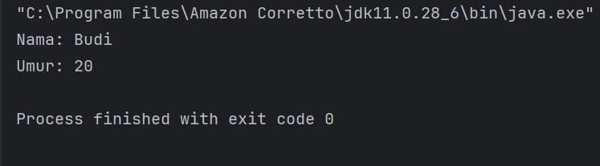
#### Analisa
Pada percobaan ini, terlihat bahwa class berfungsi sebagai cetakan (blueprint) yang mendefinisikan atribut dan method, sedangkan object merupakan representasi nyata dari class tersebut. Dengan menggunakan object, data dapat dikelola secara terstruktur karena setiap object memiliki state dan behavior masing-masing.

Penggunaan class dan object juga meningkatkan keterbacaan kode karena program dapat dipecah menjadi bagian-bagian kecil yang merepresentasikan entitas di dunia nyata. Hal ini sangat penting dalam pengembangan software skala besar.
---

### Bagian 2: Attribute dan Method
#### Penjelasan
Attribute adalah variabel dalam class, sedangkan method adalah fungsi.

#### Percobaan
```java
public class Kalkulator {
    int tambah(int a, int b) {
        return a + b;
    }
}
```
hasil program(ouput)
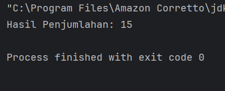
#### Analisa
Pada percobaan ini, terlihat bahwa class berfungsi sebagai cetakan (blueprint) yang mendefinisikan atribut dan method, sedangkan object merupakan representasi nyata dari class tersebut. Dengan menggunakan object, data dapat dikelola secara terstruktur karena setiap object memiliki state dan behavior masing-masing.
Penggunaan class dan object juga meningkatkan keterbacaan kode karena program dapat dipecah menjadi bagian-bagian kecil yang merepresentasikan entitas di dunia nyata. Hal ini sangat penting dalam pengembangan software skala besar.
---

### Bagian 3: Akses Modifier
#### Penjelasan
Akses modifier menentukan hak akses suatu atribut atau method.

#### Percobaan
```java
public class AksesModifier {
    public String nama = "Public";
    private int umur = 20;

    public int getUmur() {
        return umur;
    }
}
```
hasil program(output)
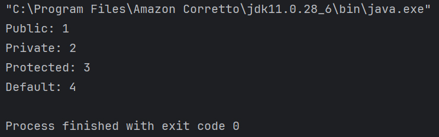
#### Analisa
Penggunaan akses modifier seperti public dan private menunjukkan pentingnya pengamanan data dalam OOP. Atribut yang bersifat private tidak dapat diakses langsung dari luar class, sehingga mencegah perubahan data secara sembarangan.
Hal ini meningkatkan keamanan dan menjaga integritas data. Selain itu, penggunaan getter sebagai penghubung antara atribut private dan luar class merupakan praktik yang baik dalam pengembangan program.
---

### Bagian 4: Setter dan Getter
#### Penjelasan
Setter untuk mengubah nilai, getter untuk mengambil nilai.

#### Percobaan
```java
public class Mobil {
    private String merk;

    public void setMerk(String merk) {
        this.merk = merk;
    }

    public String getMerk() {
        return merk;
    }
}
```
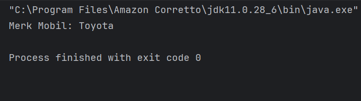
#### Analisa
Meningkatkan keamanan data.

---

### Bagian 5: Constructor
#### Penjelasan
Constructor dipanggil saat object dibuat.

#### Percobaan
```java
public class Person {
    String nama;

    Person() {
        nama = "Default";
    }

    Person(String nama) {
        this.nama = nama;
    }
}
```
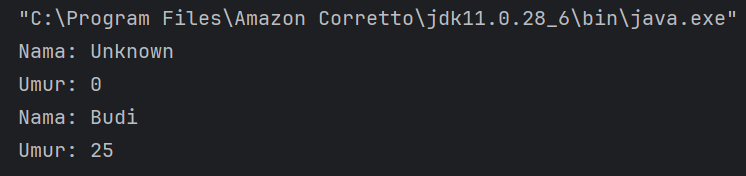
#### Analisa
Mempermudah inisialisasi object.

---

### Bagian 6: Sistem Manajemen Perpustakaan
#### Penjelasan
Menggabungkan semua konsep OOP.

#### Percobaan
```java
public class Buku {
    private String judul;
    private String pengarang;

    public Buku(String judul, String pengarang) {
        this.judul = judul;
        this.pengarang = pengarang;
    }

    public void tampilkanInfo() {
        System.out.println(judul + " - " + pengarang);
    }
}
```

#### Analisa
Program menjadi modular dan mudah dikembangkan.

---

## 3. Kesimpulan
Berdasarkan hasil praktikum yang telah dilakukan, dapat disimpulkan bahwa konsep dasar Object-Oriented Programming (OOP) sangat penting dalam pengembangan perangkat lunak. Konsep seperti class, object, attribute, method, akses modifier, setter-getter, dan constructor membantu dalam menyusun program yang lebih terstruktur dan sistematis.

Dengan menerapkan OOP, program menjadi lebih modular sehingga mudah untuk dipahami, diuji, dan dikembangkan. Selain itu, penggunaan encapsulation melalui akses modifier dan setter-getter meningkatkan keamanan data dan mencegah akses yang tidak diinginkan.

Constructor juga berperan penting dalam memastikan setiap object memiliki kondisi awal yang valid, sedangkan penggunaan struktur seperti ArrayList dalam program menunjukkan fleksibilitas dalam pengelolaan data.

Secara keseluruhan, praktikum ini memberikan pemahaman yang kuat mengenai dasar-dasar OOP yang akan sangat berguna dalam pengembangan aplikasi yang lebih kompleks di masa depan.

---

## 4. Referensi
1. Modul Praktikum Design Pattern Politeknik Negeri Lhokseumawe
2. Oracle. (2023). Java Documentation. https://docs.oracle.com/javase/
3. Schildt, H. (2019). Java: The Complete Reference. McGraw-Hill Education.
4. Bloch, J. (2018). Effective Java. Addison-Wesley.
5. Gamma, E., Helm, R., Johnson, R., & Vlissides, J. (1994). Design Patterns: Elements of Reusable Object-Oriented Software. Addison-Wesley.

--- 
 # Laporan Modul 3: Review 4 Pillar OOP menggunakan Java

------------------------------------------------------------------------

# 1. Abstrak
Pada praktikum ini dipelajari konsep dasar Object-Oriented Programming (OOP) menggunakan bahasa pemrograman Java. OOP merupakan paradigma pemrograman yang berfokus pada objek sebagai representasi dari data dan perilaku. Empat pilar utama dalam OOP yaitu Encapsulation, Inheritance, Polymorphism, dan Abstraction menjadi dasar dalam membangun program yang terstruktur, modular, dan mudah dikembangkan.

Melalui praktikum ini, mahasiswa diharapkan mampu memahami serta mengimplementasikan konsep-konsep tersebut dalam bentuk program sederhana, sehingga dapat meningkatkan kemampuan dalam merancang solusi berbasis objek.

------------------------------------------------------------------------

# 2. Praktikum
## Bagian 1: Class dan Object

### Penjelasan
Class merupakan blueprint untuk membuat object, sedangkan object adalah instance dari class yang memiliki atribut dan method.

### Percobaan
class mahasiswa
```
package praktikum_3.bagian_1;

public class Mahasiswa {
    // Atribut
    String nama;
    int umur;

    // Metode
    void displayInfo() {
        System.out.println("Nama: " + nama);
        System.out.println("Umur: " + umur);

    }
}

```
class main
```
package praktikum_3.bagian_1;

public class Main {
    public static void main(String[] args) {
        // Membuat objek
        Mahasiswa mhs1 = new Mahasiswa();
        mhs1.nama = "Budi";
        mhs1.umur = 20;

        // Memanggil metode
        mhs1.displayInfo();
    }
}

```
### Hasil
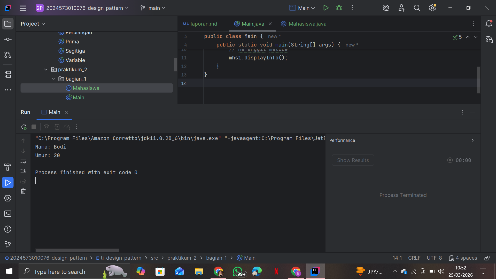
### Analisa
Dari percobaan ini dapat dipahami bahwa class digunakan sebagai template, sedangkan object merupakan implementasi nyata dari class tersebut. Penggunaan object memudahkan pengelolaan data dalam program.

---
## Bagian 2: Encapsulation

### Penjelasan
Encapsulation adalah teknik menyembunyikan data menggunakan `private` dan mengaksesnya melalui getter dan setter.

### Percobaan
class Mahasiswa
```
package praktikum_3.bagian_2;

public class Mahasiswa {
    // Atribut private
    private String nama;
    private int umur;

    // Getter dan Setter
    public String getNama() {
        return nama;
    }

    public void setNama(String nama) {
        this.nama = nama;
    }

    public int getUmur() {
        return umur;
    }

    public void setUmur(int umur) {
        this.umur = umur;
    }
}

```
class Main
```
package praktikum_3.bagian_2;

public class Main {
    public static void main(String[] args) {
        Mahasiswa mhs1 = new Mahasiswa();
        mhs1.setNama("Budi");
        mhs1.setUmur(20);

        System.out.println("Nama: " + mhs1.getNama());
        System.out.println("Umur: " + mhs1.getUmur());
    }
}

```
### Hasil
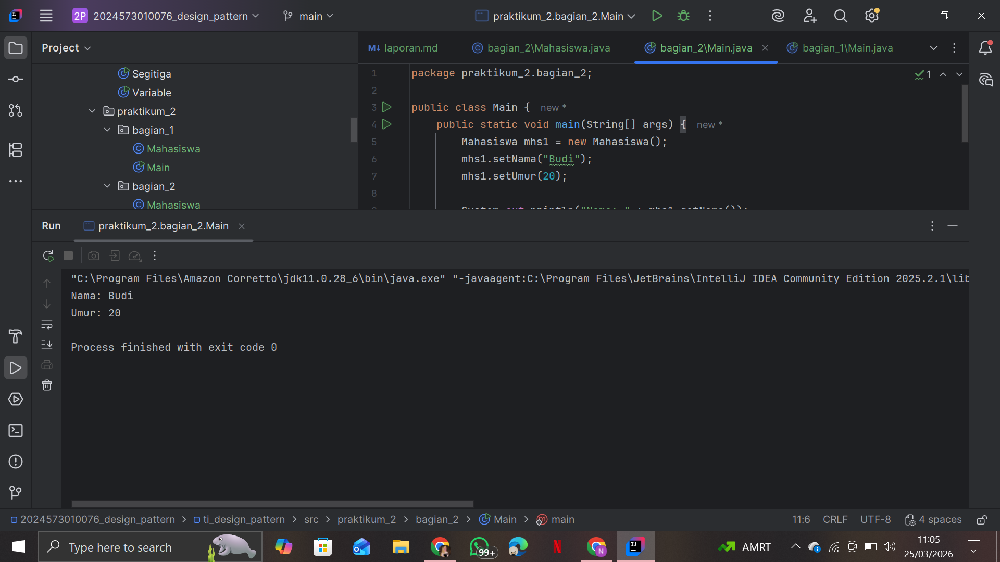
### Analisa
Encapsulation meningkatkan keamanan dan kontrol terhadap data.

---

## Bagian 3: Inheritance dan Composition

### 3.1 Inheritance

#### Penjelasan
Inheritance adalah pewarisan dari superclass ke subclass (hubungan "is-a").

#### Percobaan
class Kendaraan
```
package praktikum_3.bagian_3.pewarisan;

public class Kendaraan {
    String merk;
    int tahun;

    void displayInfo() {
        System.out.println("Merk: " + merk);
        System.out.println("Tahun: " + tahun);
    }
}

```
class Mobil
```
package praktikum_3.bagian_3.pewarisan;

public class Mobil extends Kendaraan{
    int JumlahPintu;

    void displayInfoMobil() {
        displayInfo(); // memanggil metode dari superclass
        System.out.println("Jumlah Pintu :" +JumlahPintu);
    }
}

```
class Main
```
package praktikum_3.bagian_3.pewarisan;

public class Main {
    public static void main(String[] args) {
        Mobil mobil1 = new Mobil();

        mobil1.merk = "Toyota";
        mobil1.tahun = 2021;
        mobil1.JumlahPintu = 4;

        mobil1.displayInfoMobil();
    }
}

```
#### Hasil
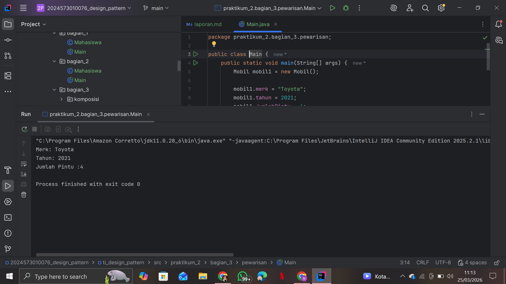
#### Analisa
Inheritance mempermudah reuse code dan membentuk hierarki class.

---

### 3.2 Composition

#### Penjelasan
Composition adalah hubungan "has-a", dimana sebuah class memiliki objek dari class lain.

#### Percobaan
class Mesin
```
package praktikum_3.bagian_3.komposisi;

public class Mesin {
    void hidupkan(){
        System.out.println("Mesin menyala.");
    }
    void matikan(){
        System.out.println("Mesin dimatikan. ");
    }
}

```
class Mobil
```
package praktikum_3.bagian_3.komposisi;

public class Mobil {
    private final Mesin mesin; // Composition

    public Mobil() {
        this.mesin = new Mesin(); // Membuat objek Mesin
    }

    void mulai() {
        mesin.hidupkan();
        System.out.println("Mobil siap digunakan.");
    }

    void berhenti() {
        mesin.matikan();
        System.out.println("Mobil berhenti.");
    }
}

```
class Main
```
package praktikum_3.bagian_3.komposisi;

public class Main {
    public static void main(String[] args) {
        Mobil mobil = new Mobil();
        mobil.mulai();
        mobil.berhenti();
    }
}

```
#### Hasil
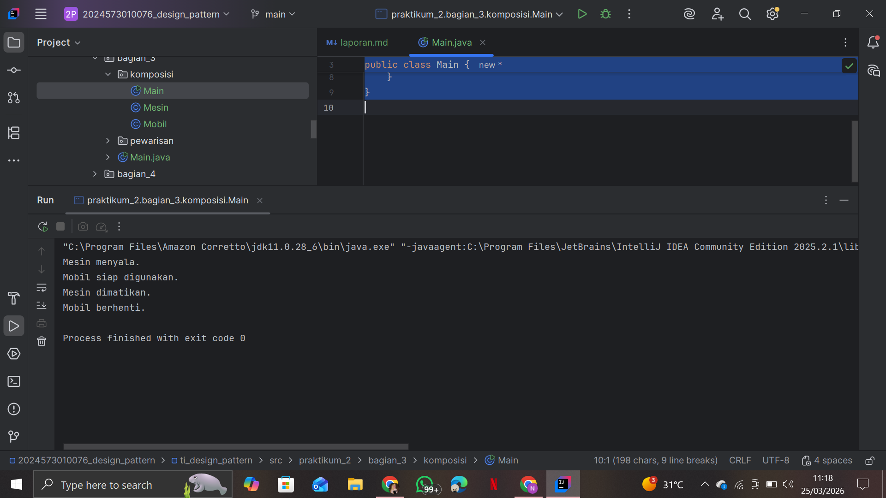
#### Analisa
Composition lebih fleksibel dibanding inheritance karena tidak bergantung pada hierarki.

---

### 3.3 Kombinasi Inheritance dan Composition

#### Penjelasan
Kedua konsep dapat digabungkan untuk membangun sistem yang kompleks.

#### Percobaan
Class Mobil mewarisi Kendaraan dan memiliki Mesin.

#### Hasil
Mobil dapat bergerak (inheritance) dan menyalakan mesin (composition).
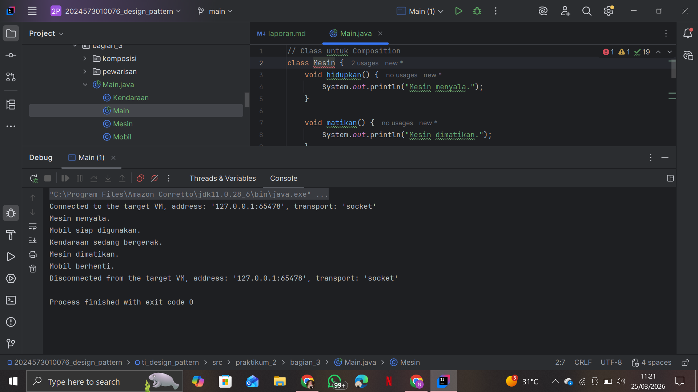
#### Analisa
Kombinasi ini memberikan desain yang lebih modular dan fleksibel.

---

## Bagian 4: Polymorphism

### 4.1 Method Overriding

#### Penjelasan
Overriding adalah penggantian method dari superclass di subclass.

#### Percobaan
class Hewan
```
package praktikum_3.bagian_4.overriding;

public class Hewan {
    void bersuara() {
        System.out.println("Hewan bersuara.");
    }
}

```
class Kucing
```
package praktikum_3.bagian_4.overriding;

public class Kucing extends Hewan{
    @Override
    void bersuara() {
        System.out.println("Meong!");
    }
}

```
class Anjing
```
package praktikum_3.bagian_4.overriding;

public class Anjing extends Hewan{
    @Override
    void bersuara() {
        System.out.println("Guk Guk!");
    }
}

```
class Main
```
package praktikum_3.bagian_4.overriding;

public class Main {
    public static void main(String[] args) {
        Hewan hewan1 = new Kucing(); // Polymorphism
        Hewan hewan2 = new Anjing(); // Polymorphism

        hewan1.bersuara(); // Output: Meong!
        hewan2.bersuara(); // Output: Guk Guk!
    }
}

```
#### Hasil
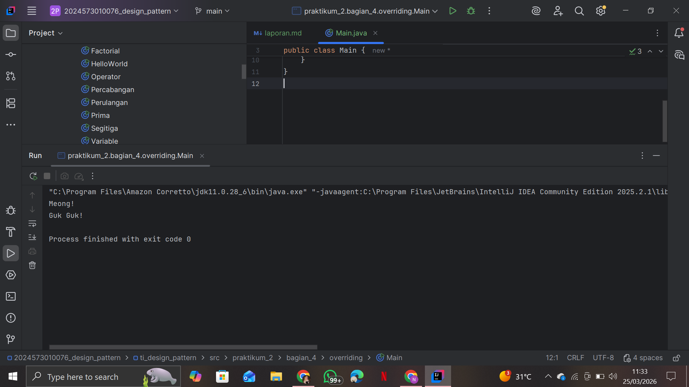

#### Analisa
Overriding memungkinkan perubahan perilaku tanpa mengubah struktur dasar.

---

### 4.2 Method Overloading

#### Penjelasan
Overloading adalah method dengan nama sama tetapi parameter berbeda.

#### Percobaan
class Kalkulator
```
package praktikum_3.bagian_4.overloading;

public class Kalkulator {
    // Method overloading: penjumlahan dua bilangan bulat
    int tambah(int a, int b) {
        return a + b;
    }

    // Method overloading: penjumlahan tiga bilangan bulat
    int tambah(int a, int b, int c) {
        return a + b + c;
    }

    // Method overloading: penjumlahan dua bilangan desimal
    double tambah(double a, double b) {
        return a + b;
    }
}

```
class Main
```
package praktikum_3.bagian_4.overloading;

public class Main {
    public static void main(String[] args) {
        Kalkulator kalkulator = new Kalkulator();

        System.out.println("Hasil 1: " + kalkulator.tambah(5, 10));     // Output: 15
        System.out.println("Hasil 2: " + kalkulator.tambah(5, 10, 15)); // Output: 30
        System.out.println("Hasil 3: " + kalkulator.tambah(3.5, 2.5));  // Output: 6.0
    }
}

```
#### Hasil
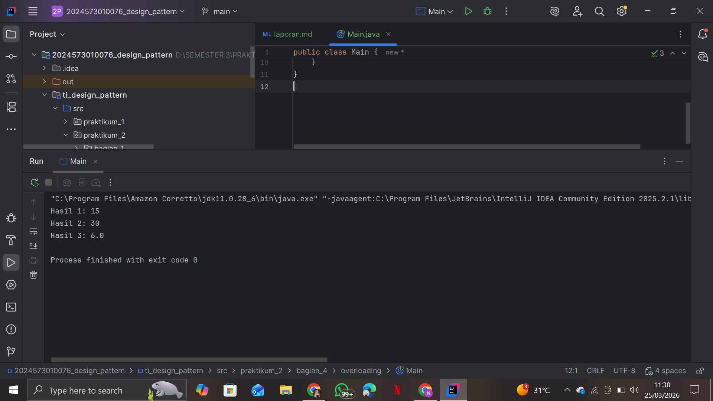
#### Analisa
Overloading meningkatkan fleksibilitas dalam pemanggilan method.

---

### 4.3 Perbandingan Overriding dan Overloading

#### Analisa
Overriding terjadi antar class (inheritance), sedangkan overloading terjadi dalam satu class. Keduanya mendukung polymorphism.

---

## Bagian 5: Abstraction

### 5.1 Abstract Class

#### Penjelasan
Abstract class adalah class yang tidak bisa diinstansiasi dan memiliki method abstrak.

#### Percobaan
class Hewan
```
package praktikum_3.bagian_5.abstrak;

abstract class Hewan {
    // Atribut
    String nama;

    // Method konkret
    void makan() {
        System.out.println(nama + " sedang makan.");
    }

    // Method abstrak
    abstract void bersuara();

}

```
class Kucing
```
package praktikum_3.bagian_5.abstrak;

// Subclass dari abstract class
class Kucing extends Hewan {

    @Override
    void bersuara() {
        System.out.println("Meong!");
    }
}

```
class Anjing
```
package praktikum_3.bagian_5.abstrak;

class Anjing extends Hewan {
    @Override
    void bersuara() {
        System.out.println("Guk Guk!");
    }

}

```
class Main
```
package praktikum_3.bagian_5.abstrak;

public class Main {
    public static void main(String[] args) {
        Hewan kucing = new Kucing();
        kucing.nama = "Kitty";
        kucing.makan(); // Method konkret dari abstract class
        kucing.bersuara(); // Method abstrak yang di-override

        Hewan anjing = new Anjing();
        anjing.nama = "Doggy";
        anjing.makan(); // Method konkret dari abstract class
        anjing.bersuara(); // Method abstrak yang di-override
    }
}

```
#### Hasil
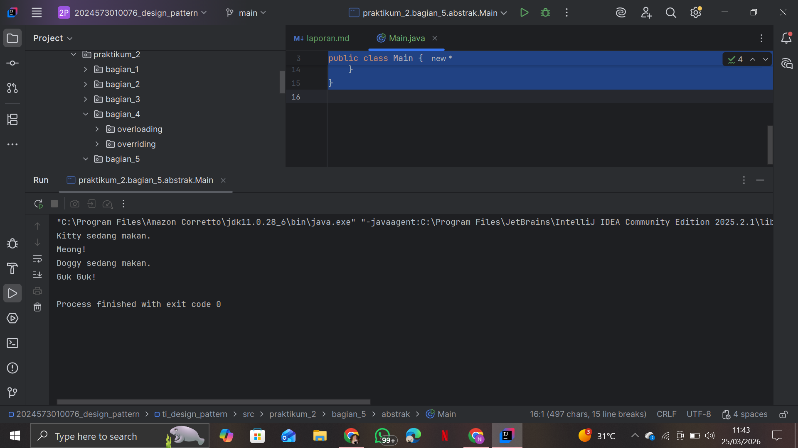
#### Analisa
Abstract class membantu membuat kerangka dasar program.

---

### 5.2 Interface

#### Penjelasan
Interface adalah kontrak yang harus diimplementasikan oleh class.

#### Percobaan
class Bergerak
```
package praktikum_3.bagian_5.antarmuka;

// Interface
interface Bergerak {
    // Method abstrak
    void bergerak();

    // Method default (Java 8+)
    default void berhenti() {
        System.out.println("Berhenti bergerak.");
    }

    // Method static (Java 8+)
    static void info() {
        System.out.println("Ini adalah interface Bergerak.");
    }
}

```
class Mobil
```
package praktikum_3.bagian_5.antarmuka;

class Mobil implements Bergerak {
    @Override
    public void bergerak() {
        System.out.println("Mobil sedang melaju.");
    }
}

```
class Pesawat
```
package praktikum_3.bagian_5.antarmuka;

class Pesawat implements Bergerak {
    @Override
    public void bergerak() {
        System.out.println("pesawat sedang terbabng.");
    }
}

```
class Main
```
package praktikum_3.bagian_5.antarmuka;

public class Main {
    public static void main(String[] args) {
        Bergerak mobil = new Mobil();
        mobil.bergerak(); // Method dari interface
        mobil.berhenti(); // Method default dari interface

        Bergerak pesawat = new Pesawat();
        pesawat.bergerak(); // Method dari interface
        pesawat.berhenti(); // Method default dari interface

        Bergerak.info(); // Method static dari interface
    }
}
```
#### Hasil
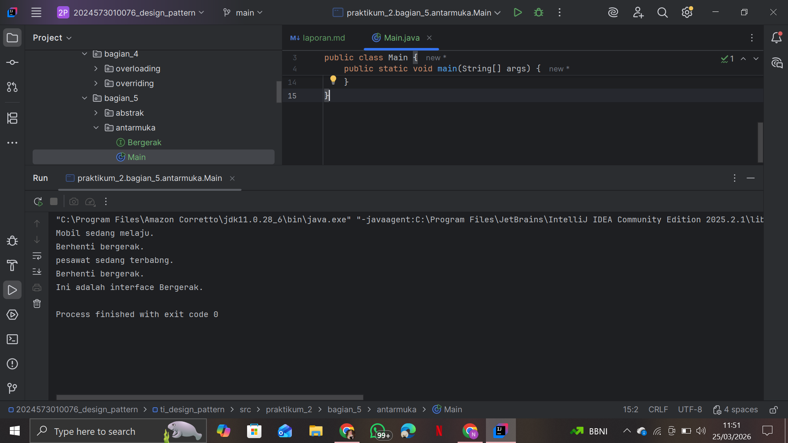
#### Analisa
Interface mendukung multiple inheritance dan fleksibilitas desain.

---

### 5.3 Perbandingan Abstract Class dan Interface

#### Analisa
Abstract class cocok untuk hubungan "is-a", sedangkan interface untuk kemampuan tambahan (contract). Interface lebih fleksibel.

---

## Bagian 6: Aplikasi Pemesanan Tiket

### Penjelasan
Aplikasi ini menggabungkan seluruh konsep OOP.

### Percobaan
Membuat class:
- Tiket (abstract)
```
package praktikum_3.bagian_6;

abstract class Tiket {
    private final String jenis;
    private final double harga;

    public Tiket(String jenis, double harga) {
        this.jenis = jenis;
        this.harga = harga;
    }

    public String getJenis() {
        return jenis;
    }

    public double getHarga() {
        return harga;
    }

    public abstract double hitungDiskon();
}
```
- TiketReguler & TiketVIP (inheritance)
```
package praktikum_3.bagian_6;

public class TiketReguler extends Tiket{
    public TiketReguler() {
        super("Reguler", 100000); // Harga tiket reguler
    }

    @Override
    public double hitungDiskon() {
        return 0; // Tidak ada diskon untuk tiket reguler
    }
}

```
```
package praktikum_3.bagian_6;

public class TiketVIP extends Tiket{
    public TiketVIP() {
        super("VIP", 250000); // Harga tiket VIP
    }

    @Override
    public double hitungDiskon() {
        return 0.1 * getHarga(); // Diskon 10% untuk tiket VIP
    }
}

```
- Pesanan
```
package praktikum_3.bagian_6;

public class Pesanan {
    private final String namaPemesan;
    private final Tiket tiket;
    private final int jumlah;

    public Pesanan(String namaPemesan, Tiket tiket, int jumlah) {
        this.namaPemesan = namaPemesan;
        this.tiket = tiket;
        this.jumlah = jumlah;
    }

    public String getNamaPemesan() {
        return namaPemesan;
    }

    public Tiket getTiket() {
        return tiket;
    }

    public int getJumlah() {
        return jumlah;
    }

    // Menghitung total harga setelah diskon
    public double hitungTotal() {
        double total = tiket.getHarga() * jumlah;
        double diskon = tiket.hitungDiskon() * jumlah;
        return total - diskon;
    }

    // Menampilkan detail pesanan
    public void displayDetail() {
        System.out.println("\nDetail Pesanan:");
        System.out.println("Nama Pemesan: " + namaPemesan);
        System.out.println("Jenis Tiket: " + tiket.getJenis());
        System.out.println("Jumlah: " + jumlah);
        System.out.println("Total Harga: Rp " + hitungTotal());
    }
}

```
- KonferensiApp
```
package praktikum_3.bagian_6;

import java.util.ArrayList;
import java.util.Scanner;

public class KonferensiApp {
    private static final ArrayList<Pesanan> daftarPesanan = new ArrayList<>();
    private static final Scanner scanner = new Scanner(System.in);

    public static void main(String[] args) {
        while (true) {
            System.out.println("\n=== Aplikasi Pemesanan Tiket Konferensi ===");
            System.out.println("1. Lihat Daftar Tiket");
            System.out.println("2. Pesan Tiket");
            System.out.println("3. Lihat Detail Pesanan");
            System.out.println("4. Batalkan Pesanan");
            System.out.println("5. Keluar");
            System.out.print("Pilih menu: ");

            int pilihan = scanner.nextInt();
            scanner.nextLine(); // Membersihkan newline

            switch (pilihan) {
                case 1:
                    lihatDaftarTiket();
                    break;
                case 2:
                    pesanTiket();
                    break;
                case 3:
                    lihatDetailPesanan();
                    break;
                case 4:
                    batalkanPesanan();
                    break;
                case 5:
                    System.out.println("Terima kasih telah menggunakan aplikasi ini.");
                    System.exit(0);
                default:
                    System.out.println("Pilihan tidak valid. Silakan coba lagi.");
            }
        }
    }

    // Method untuk menampilkan daftar tiket
    private static void lihatDaftarTiket() {
        System.out.println("\nDaftar Tiket:");
        System.out.println("1. Tiket Reguler - Rp100.000");
        System.out.println("2. Tiket VIP - Rp250.000 (Diskon 10%)");
    }

    // Method untuk memesan tiket
    private static void pesanTiket() {
        System.out.print("\nMasukkan nama pemesan: ");
        String namaPemesan = scanner.nextLine();

        System.out.print("Pilih jenis tiket (1: Reguler, 2: VIP): ");
        int jenisTiket = scanner.nextInt();

        System.out.print("Masukkan jumlah tiket: ");
        int jumlah = scanner.nextInt();

        Tiket tiket = null;

        switch (jenisTiket) {
            case 1:
                tiket = new TiketReguler();
                break;
            case 2:
                tiket = new TiketVIP();
                break;
            default:
                System.out.println("Jenis tiket tidak valid.");
                return;
        }

        Pesanan pesanan = new Pesanan(namaPemesan, tiket, jumlah);
        daftarPesanan.add(pesanan);

        System.out.println("Pesanan berhasil dibuat!");
        pesanan.displayDetail();
    }

    // Method untuk melihat detail pesanan
    private static void lihatDetailPesanan() {
        if (isNoPesanan()) return;

        System.out.print("Pilih nomor pesanan untuk melihat detail: ");
        int nomorPesanan = scanner.nextInt();

        if (nomorPesanan > 0 && nomorPesanan <= daftarPesanan.size()) {
            daftarPesanan.get(nomorPesanan - 1).displayDetail();
        } else {
            System.out.println("Nomor pesanan tidak valid.");
        }
    }

    private static boolean isNoPesanan() {
        if (daftarPesanan.isEmpty()) {
            System.out.println("\nBelum ada pesanan.");
            return true;
        }

        System.out.println("\nDaftar Pesanan:");
        for (int i = 0; i < daftarPesanan.size(); i++) {
            System.out.println((i + 1) + ". " + daftarPesanan.get(i).getNamaPemesan());
        }

        return false;
    }

    // Method untuk membatalkan pesanan
    private static void batalkanPesanan() {
        if (isNoPesanan()) return;

        System.out.print("Pilih nomor pesanan yang ingin dibatalkan: ");
        int nomorPesanan = scanner.nextInt();
        if (nomorPesanan > 0 && nomorPesanan <= daftarPesanan.size()) {
            daftarPesanan.remove(nomorPesanan - 1);
            System.out.println("Pesanan berhasil dibatalkan.");
        } else {
            System.out.println("Nomor pesanan tidak valid.");
        }
    }
}

```

### Hasil
Program dapat:
- Menampilkan tiket
- Memesan tiket
- Menghitung total harga
- Membatalkan pesanan
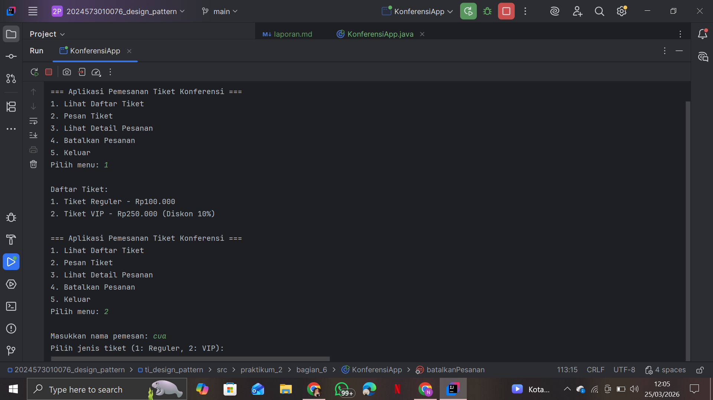
### Analisa
Semua konsep OOP digunakan:
- Encapsulation → atribut
- Inheritance → jenis tiket
- Polymorphism → diskon
- Abstraction → class Tiket

Program menjadi modular dan mudah dikembangkan.

------------------------------------------------------------------------

# 3. Kesimpulan
Praktikum ini menunjukkan bahwa OOP sangat penting dalam pengembangan program. Dengan menggunakan Encapsulation, Inheritance, Polymorphism, dan Abstraction, program menjadi lebih terstruktur, fleksibel, dan mudah dikembangkan.

------------------------------------------------------------------------

# 4. Referensi
1. Modul Praktikum Design Pattern Politeknik Negeri Lhokseumawe
2. Oracle Java Documentation
3. Buku Pemrograman Berorientasi Objek (OOP) dengan Java 