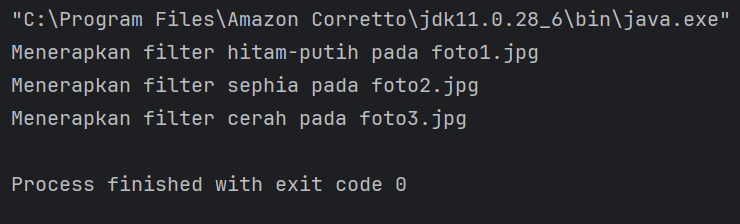
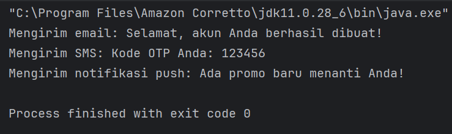
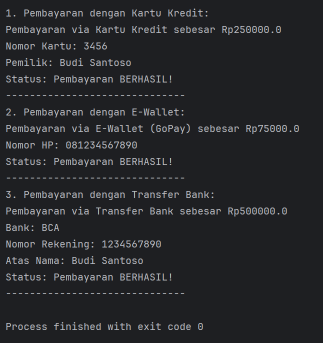

# LAPORAN PRAKTIKUM DESIGN PATTERN

## MODUL 9 – STRATEGY PATTERN

**Nama :** Nasywa Nurshabira
**NIM :** 2024573010076
**Kelas :** TI 2A

---

# 1. Abstrak

Pada praktikum ini dipelajari salah satu design pattern dalam pemrograman berorientasi objek yaitu Strategy Pattern. Pattern ini digunakan untuk memisahkan algoritma ke dalam class yang berbeda sehingga algoritma dapat diganti secara fleksibel tanpa mengubah kode utama program.

Praktikum dilakukan menggunakan beberapa studi kasus seperti program navigasi sederhana, filter foto, sistem notifikasi, dan sistem pembayaran e-commerce. Setiap studi kasus menerapkan konsep Strategy Pattern dengan memanfaatkan interface sebagai strategy dan class lain sebagai implementasi strategi.

Melalui praktikum ini dapat dipahami bahwa Strategy Pattern membantu membuat program menjadi lebih modular, fleksibel, mudah dipelihara, dan lebih mudah dikembangkan ketika terdapat penambahan fitur baru.

---

# 2. Latar Belakang

Dalam pengembangan perangkat lunak, sering ditemukan kasus di mana sebuah program memiliki beberapa algoritma atau metode berbeda untuk menyelesaikan suatu proses. Jika seluruh algoritma tersebut ditulis langsung di dalam satu class menggunakan banyak percabangan seperti if-else atau switch, maka kode program akan menjadi sulit dipahami dan sulit dikembangkan.

Salah satu solusi untuk mengatasi masalah tersebut adalah menggunakan Strategy Pattern. Strategy Pattern merupakan salah satu behavioral design pattern yang memungkinkan algoritma dipisahkan ke dalam class yang berbeda. Dengan cara ini, algoritma dapat dipilih dan diganti saat program berjalan tanpa harus mengubah kode utama.

Penggunaan Strategy Pattern sangat membantu dalam meningkatkan fleksibilitas program. Selain itu, pattern ini juga mendukung prinsip Open/Closed Principle karena penambahan strategi baru dapat dilakukan tanpa mengubah class yang sudah ada.

Melalui praktikum ini mahasiswa mempelajari bagaimana cara mengimplementasikan Strategy Pattern menggunakan bahasa Java serta memahami manfaat penggunaannya dalam pengembangan aplikasi.

---

# 3. Tujuan Praktikum

1. Memahami konsep Strategy Pattern.
2. Mengimplementasikan Strategy Pattern menggunakan Java.
3. Memahami manfaat penggunaan Strategy Pattern dalam pengembangan perangkat lunak.
4. Membuat program yang fleksibel dan mudah dikembangkan.

---

# 4. Praktikum

# 4.1 Praktikum 1 – Program Navigasi Sederhana

## 4.1.1 Langkah Praktikum

1. Membuat package `modul_9`.
2. Membuat package `praktikum_1`.
3. Membuat interface `RouteStrategy`.
4. Membuat class `WalkingRoute`.
5. Membuat class `DrivingRoute`.
6. Membuat class `PublicTransportRoute`.
7. Membuat class `Navigator`.
8. Membuat class `Main`.
9. Menjalankan program dan mengamati hasil output.

---

## 4.1.2 Kode Program

### Interface RouteStrategy

```java
public interface RouteStrategy {
    void buildRoute(String from, String to);
}
```

---

### Class WalkingRoute

```java
public class WalkingRoute implements RouteStrategy {

    @Override
    public void buildRoute(String from, String to) {
        System.out.println("Rute jalan kaki dari " + from + " ke " + to);
    }
}
```

---

### Class DrivingRoute

```java
public class DrivingRoute implements RouteStrategy {

    @Override
    public void buildRoute(String from, String to) {
        System.out.println("Rute berkendara dari " + from + " ke " + to);
    }
}
```

---

### Class PublicTransportRoute

```java
public class PublicTransportRoute implements RouteStrategy {

    @Override
    public void buildRoute(String from, String to) {
        System.out.println("Rute transportasi umum dari " + from + " ke " + to);
    }
}
```

---

### Class Navigator

```java
public class Navigator {

    private RouteStrategy strategy;

    public Navigator(RouteStrategy strategy) {
        this.strategy = strategy;
    }

    public void setStrategy(RouteStrategy strategy) {
        this.strategy = strategy;
    }

    public void navigate(String from, String to) {
        strategy.buildRoute(from, to);
    }
}
```

---

### Class Main

```java
public class Main {

    public static void main(String[] args) {

        Navigator navigator = new Navigator(new WalkingRoute());

        navigator.navigate("Rumah", "Kampus");

        navigator.setStrategy(new DrivingRoute());
        navigator.navigate("Rumah", "Mall");

        navigator.setStrategy(new PublicTransportRoute());
        navigator.navigate("Terminal", "Bandara");
    }
}
```

---

## 4.1.3 Hasil Output


---

## 4.1.4 Analisa

Pada praktikum ini digunakan Strategy Pattern untuk menentukan jenis rute navigasi yang digunakan pengguna.

Setiap metode navigasi dipisahkan ke dalam class yang berbeda, yaitu `WalkingRoute`, `DrivingRoute`, dan `PublicTransportRoute`. Semua class tersebut mengimplementasikan interface `RouteStrategy`.

Class `Navigator` bertindak sebagai context class yang menggunakan strategy tertentu sesuai kebutuhan pengguna. Dengan cara ini, jenis rute dapat diganti tanpa perlu mengubah kode utama program.

Penerapan Strategy Pattern membuat program menjadi lebih fleksibel dan mudah dikembangkan. Jika suatu saat ingin menambahkan strategi baru seperti rute sepeda atau rute tercepat, programmer hanya perlu membuat class baru tanpa mengubah class `Navigator`.

---

# 4.2 Praktikum 2 – Program Filter Foto Sederhana

## 4.2.1 Langkah Praktikum

1. Membuat package `praktikum_2`.
2. Membuat interface `FilterStrategy`.
3. Membuat class `BlackWhiteFilter`.
4. Membuat class `SepiaFilter`.
5. Membuat class `BrightFilter`.
6. Membuat class `PhotoEditor`.
7. Membuat class `Main`.
8. Menjalankan program dan mengamati hasil output.

---

## 4.2.2 Kode Program

### Interface FilterStrategy

```java
public interface FilterStrategy {
    void applyFilter(String photo);
}
```

---

### Class BlackWhiteFilter

```java
public class BlackWhiteFilter implements FilterStrategy {

    @Override
    public void applyFilter(String photo) {
        System.out.println("Filter hitam putih diterapkan pada " + photo);
    }
}
```

---

### Class SepiaFilter

```java
public class SepiaFilter implements FilterStrategy {

    @Override
    public void applyFilter(String photo) {
        System.out.println("Filter sepia diterapkan pada " + photo);
    }
}
```

---

### Class BrightFilter

```java
public class BrightFilter implements FilterStrategy {

    @Override
    public void applyFilter(String photo) {
        System.out.println("Filter cerah diterapkan pada " + photo);
    }
}
```

---

### Class PhotoEditor

```java
public class PhotoEditor {

    private FilterStrategy strategy;

    public PhotoEditor(FilterStrategy strategy) {
        this.strategy = strategy;
    }

    public void setStrategy(FilterStrategy strategy) {
        this.strategy = strategy;
    }

    public void editPhoto(String photo) {
        strategy.applyFilter(photo);
    }
}
```

---

### Class Main

```java
public class Main {

    public static void main(String[] args) {

        PhotoEditor editor =
                new PhotoEditor(new BlackWhiteFilter());

        editor.editPhoto("foto1.jpg");

        editor.setStrategy(new SepiaFilter());
        editor.editPhoto("foto2.jpg");

        editor.setStrategy(new BrightFilter());
        editor.editPhoto("foto3.jpg");
    }
}
```

---

## 4.2.3 Hasil Output

<br><br><br><br><br><br>

---

## 4.2.4 Analisa

Pada praktikum ini Strategy Pattern digunakan untuk menangani berbagai jenis filter foto.

Setiap filter dipisahkan ke dalam class tersendiri sehingga program menjadi lebih modular dan mudah dipelihara. `PhotoEditor` hanya bertugas menggunakan filter yang dipilih tanpa mengetahui detail proses filter tersebut.

Dengan penggunaan Strategy Pattern, penambahan filter baru dapat dilakukan tanpa mengubah struktur utama program. Hal ini membuat kode lebih fleksibel dan sesuai dengan prinsip Open/Closed Principle.

---

# 4.3 Praktikum 3 – Program Notifikasi

## 4.3.1 Langkah Praktikum

1. Membuat package `praktikum_3`.
2. Membuat interface `NotificationStrategy`.
3. Membuat class `EmailNotification`.
4. Membuat class `SMSNotification`.
5. Membuat class `PushNotification`.
6. Membuat class `NotificationService`.
7. Membuat class `Main`.
8. Menjalankan program dan mengamati hasil output.

---

## 4.3.2 Kode Program

### Interface NotificationStrategy

```java
public interface NotificationStrategy {

    void sendNotification(String message);
}
```

---

### Class EmailNotification

```java
public class EmailNotification implements NotificationStrategy {

    @Override
    public void sendNotification(String message) {
        System.out.println("Mengirim Email: " + message);
    }
}
```

---

### Class SMSNotification

```java
public class SMSNotification implements NotificationStrategy {

    @Override
    public void sendNotification(String message) {
        System.out.println("Mengirim SMS: " + message);
    }
}
```

---

### Class PushNotification

```java
public class PushNotification implements NotificationStrategy {

    @Override
    public void sendNotification(String message) {
        System.out.println("Mengirim Push Notification: " + message);
    }
}
```

---

### Class NotificationService

```java
public class NotificationService {

    private NotificationStrategy strategy;

    public NotificationService(NotificationStrategy strategy) {
        this.strategy = strategy;
    }

    public void send(String message) {
        strategy.sendNotification(message);
    }
}
```

---

### Class Main

```java
public class Main {

    public static void main(String[] args) {

        NotificationService email =
                new NotificationService(new EmailNotification());

        NotificationService sms =
                new NotificationService(new SMSNotification());

        NotificationService push =
                new NotificationService(new PushNotification());

        email.send("Halo pengguna!");
        sms.send("Kode OTP Anda");
        push.send("Ada pesan baru");
    }
}
```

---

## 4.3.3 Hasil Output



---

## 4.3.4 Analisa

Pada praktikum ini digunakan Strategy Pattern untuk menangani berbagai metode pengiriman notifikasi.

Setiap metode notifikasi dipisahkan ke dalam class tersendiri sehingga sistem menjadi lebih fleksibel. `NotificationService` hanya menggunakan strategy yang dipilih tanpa mengetahui detail implementasi notifikasi tersebut.

Penerapan Strategy Pattern membuat penambahan metode notifikasi baru menjadi lebih mudah. Programmer cukup membuat class baru tanpa mengubah class yang sudah ada.

---

# 4.4 Latihan – Program Pembayaran E-Commerce

## 4.4.1 Langkah Praktikum

1. Membuat package `latihan`.
2. Membuat interface `PaymentStrategy`.
3. Membuat class `CreditCardPayment`.
4. Membuat class `EWalletPayment`.
5. Membuat class `BankTransferPayment`.
6. Membuat class `Checkout`.
7. Membuat class `Main`.
8. Menjalankan program dan mengamati hasil output.
9. Menjawab tugas analisis pada file `jawaban.md`.

---

## 4.4.2 Kode Program

### Interface PaymentStrategy

```java
public interface PaymentStrategy {

    void pay(double amount);
}
```

---

### Class CreditCardPayment

```java
public class CreditCardPayment implements PaymentStrategy {

    @Override
    public void pay(double amount) {
        System.out.println("Pembayaran dengan kartu kredit sebesar Rp" + amount);
    }
}
```

---

### Class EWalletPayment

```java
public class EWalletPayment implements PaymentStrategy {

    @Override
    public void pay(double amount) {
        System.out.println("Pembayaran dengan E-Wallet sebesar Rp" + amount);
    }
}
```

---

### Class BankTransferPayment

```java
public class BankTransferPayment implements PaymentStrategy {

    @Override
    public void pay(double amount) {
        System.out.println("Pembayaran dengan transfer bank sebesar Rp" + amount);
    }
}
```

---

### Class Checkout

```java
public class Checkout {

    private PaymentStrategy strategy;

    public Checkout(PaymentStrategy strategy) {
        this.strategy = strategy;
    }

    public void processPayment(double amount) {
        strategy.pay(amount);
    }
}
```

---

### Class Main

```java
public class Main {

    public static void main(String[] args) {

        Checkout creditCard =
                new Checkout(new CreditCardPayment());

        Checkout ewallet =
                new Checkout(new EWalletPayment());

        Checkout transfer =
                new Checkout(new BankTransferPayment());

        creditCard.processPayment(500000);
        ewallet.processPayment(250000);
        transfer.processPayment(1000000);
    }
}
```

---

## 4.4.3 Hasil Output



---

## 4.4.4 Analisa

Pada latihan ini Strategy Pattern digunakan untuk menangani berbagai metode pembayaran dalam sistem e-commerce.

Setiap metode pembayaran dipisahkan ke dalam class yang berbeda sehingga program menjadi lebih fleksibel dan mudah dikembangkan. `Checkout` hanya menggunakan strategy pembayaran tanpa mengetahui detail proses pembayaran tersebut.

Jika suatu saat ingin menambahkan metode pembayaran baru seperti QRIS, programmer hanya perlu membuat class baru yang mengimplementasikan `PaymentStrategy` tanpa mengubah class `Checkout`.

Hal ini membuat program lebih mudah dipelihara dan mengurangi risiko error pada kode yang sudah ada.

---

# Latihan – Sistem Pembayaran E-Commerce

## Langkah Praktikum

1. Membuat package `praktikum_7.latihan`.
2. Membuat interface `PaymentStrategy`.
3. Membuat class `CreditCardPayment`.
4. Membuat class `EWalletPayment`.
5. Membuat class `BankTransferPayment`.
6. Membuat class `Checkout`.
7. Membuat class `Main`.
8. Menjalankan program menggunakan IntelliJ IDEA.
9. Mengamati hasil output dari setiap metode pembayaran.
10. Menganalisis penerapan Strategy Pattern pada sistem pembayaran e-commerce.

---

## Kode Program

### Interface PaymentStrategy

```java
package praktikum_7.latihan;

public interface PaymentStrategy {
    void pay(double amount);
}
```

---

### Class CreditCardPayment

```java
package praktikum_7.latihan;

public class CreditCardPayment implements PaymentStrategy {
    private String cardNumber;
    private String cardHolderName;
    private String cvv;

    public CreditCardPayment(String cardNumber, String cardHolderName, String cvv) {
        this.cardNumber = cardNumber;
        this.cardHolderName = cardHolderName;
        this.cvv = cvv;
    }

    @Override
    public void pay(double amount) {
        System.out.println("Pembayaran via Kartu Kredit sebesar Rp" + amount);
        System.out.println("Nomor Kartu: " + cardNumber.substring(cardNumber.length() - 4));
        System.out.println("Pemilik: " + cardHolderName);
        System.out.println("Status: Pembayaran BERHASIL!");
        System.out.println("------------------------------");
    }
}
```

---

### Class EWalletPayment

```java
package praktikum_7.latihan;

public class EWalletPayment implements PaymentStrategy {
    private String phoneNumber;
    private String provider;

    public EWalletPayment(String phoneNumber, String provider) {
        this.phoneNumber = phoneNumber;
        this.provider = provider;
    }

    @Override
    public void pay(double amount) {
        System.out.println("Pembayaran via E-Wallet (" + provider + ") sebesar Rp" + amount);
        System.out.println("Nomor HP: " + phoneNumber);
        System.out.println("Status: Pembayaran BERHASIL!");
        System.out.println("------------------------------");
    }
}
```

---

### Class BankTransferPayment

```java
package praktikum_7.latihan;

public class BankTransferPayment implements PaymentStrategy {
    private String bankName;
    private String accountNumber;
    private String accountName;

    public BankTransferPayment(String bankName, String accountNumber, String accountName) {
        this.bankName = bankName;
        this.accountNumber = accountNumber;
        this.accountName = accountName;
    }

    @Override
    public void pay(double amount) {
        System.out.println("Pembayaran via Transfer Bank sebesar Rp" + amount);
        System.out.println("Bank: " + bankName);
        System.out.println("Nomor Rekening: " + accountNumber);
        System.out.println("Atas Nama: " + accountName);
        System.out.println("Status: Pembayaran BERHASIL!");
        System.out.println("------------------------------");
    }
}
```

---

### Class Checkout

```java
package praktikum_7.latihan;

public class Checkout {
    private PaymentStrategy paymentStrategy;

    public Checkout() {}

    public void setPaymentStrategy(PaymentStrategy paymentStrategy) {
        this.paymentStrategy = paymentStrategy;
    }

    public void processPayment(double amount) {
        if (paymentStrategy == null) {
            System.out.println("Error: Belum memilih metode pembayaran!");
            return;
        }
        paymentStrategy.pay(amount);
    }
}
```

---

### Class Main

```java
package praktikum_7.latihan;

public class Main {
    public static void main(String[] args) {
        Checkout checkout = new Checkout();

        System.out.println("========== E-COMMERCE CHECKOUT SYSTEM ==========\n");

        // Contoh 1: Pembayaran dengan Kartu Kredit
        System.out.println("1. Pembayaran dengan Kartu Kredit:");
        checkout.setPaymentStrategy(new CreditCardPayment(
                "1234-5678-9012-3456",
                "Budi Santoso",
                "123"));

        checkout.processPayment(250000);

        // Contoh 2: Pembayaran dengan E-Wallet
        System.out.println("2. Pembayaran dengan E-Wallet:");
        checkout.setPaymentStrategy(new EWalletPayment(
                "081234567890",
                "GoPay"));

        checkout.processPayment(75000);

        // Contoh 3: Pembayaran dengan Transfer Bank
        System.out.println("3. Pembayaran dengan Transfer Bank:");
        checkout.setPaymentStrategy(new BankTransferPayment(
                "BCA",
                "1234567890",
                "Budi Santoso"));

        checkout.processPayment(500000);
    }
}
```

---

## Hasil Output



---

## Analisa

Pada latihan ini digunakan Strategy Pattern untuk menangani berbagai metode pembayaran pada sistem e-commerce. Setiap metode pembayaran dipisahkan ke dalam class yang berbeda agar program menjadi lebih fleksibel dan mudah dikembangkan.

Interface `PaymentStrategy` digunakan sebagai strategy utama yang berisi method `pay()`. Seluruh metode pembayaran seperti `CreditCardPayment`, `EWalletPayment`, dan `BankTransferPayment` mengimplementasikan interface tersebut sehingga memiliki struktur method yang sama.

Class `Checkout` bertindak sebagai context class yang bertugas memilih dan menjalankan metode pembayaran tertentu sesuai kebutuhan pengguna. Dengan penggunaan method `setPaymentStrategy()`, sistem dapat mengganti metode pembayaran secara dinamis saat program berjalan.

Pada pembayaran kartu kredit, program menampilkan informasi nomor kartu, nama pemilik kartu, serta status pembayaran berhasil. Nomor kartu hanya menampilkan empat digit terakhir untuk menjaga keamanan data pengguna.

Pada pembayaran E-Wallet, program menampilkan provider dompet digital yang digunakan serta nomor telepon pengguna. Sedangkan pada pembayaran transfer bank, program menampilkan nama bank, nomor rekening, dan nama pemilik rekening.

Penerapan Strategy Pattern pada program ini membuat struktur kode menjadi lebih rapi karena setiap metode pembayaran memiliki class tersendiri. Selain itu, penambahan metode pembayaran baru seperti QRIS atau Virtual Account dapat dilakukan tanpa mengubah class `Checkout`.

Program juga menjadi lebih mudah dipelihara karena setiap perubahan pada metode pembayaran cukup dilakukan pada class terkait tanpa mempengaruhi class lainnya.

---

## Jawaban Analisis Latihan

### 1. Mengapa Strategy Pattern cocok digunakan pada sistem pembayaran e-commerce?

Strategy Pattern cocok digunakan karena sistem pembayaran biasanya memiliki banyak metode pembayaran dengan proses yang berbeda-beda. Dengan memisahkan setiap metode pembayaran ke dalam class tersendiri, program menjadi lebih fleksibel dan mudah dikembangkan.

---

### 2. Apa keuntungan penggunaan interface `PaymentStrategy`?

Penggunaan interface `PaymentStrategy` membuat seluruh metode pembayaran memiliki struktur method yang sama sehingga dapat digunakan secara bergantian tanpa mengubah kode utama program.

---

### 3. Mengapa class `Checkout` disebut context class?

Karena class `Checkout` bertugas menggunakan strategy tertentu yang dipilih pengguna dan menjalankan proses pembayaran berdasarkan strategy tersebut.

---

### 4. Apa manfaat utama penggunaan Strategy Pattern pada program ini?

Manfaat utamanya adalah:

* Program lebih fleksibel.
* Kode lebih rapi dan modular.
* Penambahan metode pembayaran baru lebih mudah.
* Mengurangi penggunaan percabangan berlebihan.
* Program lebih mudah dipelihara dan dikembangkan.
---

# 5. Kesimpulan

Berdasarkan praktikum yang telah dilakukan, dapat disimpulkan bahwa Strategy Pattern merupakan salah satu design pattern yang sangat berguna dalam pengembangan perangkat lunak.

Dengan memisahkan algoritma ke dalam class tersendiri, program menjadi lebih fleksibel, modular, dan mudah dikembangkan. Selain itu, penambahan fitur baru dapat dilakukan tanpa mengubah struktur utama program.

Penerapan Strategy Pattern juga membantu mengurangi penggunaan percabangan yang berlebihan sehingga kode menjadi lebih rapi dan mudah dipahami.

---

# 6. Referensi

1. Modul Praktikum Design Pattern – Politeknik Negeri Lhokseumawe.
2. Gamma, E., Helm, R., Johnson, R., & Vlissides, J. (1994). *Design Patterns: Elements of Reusable Object-Oriented Software*.
3. Martin, R. C. (2008). *Clean Code*.
4. Oracle Java Documentation.
